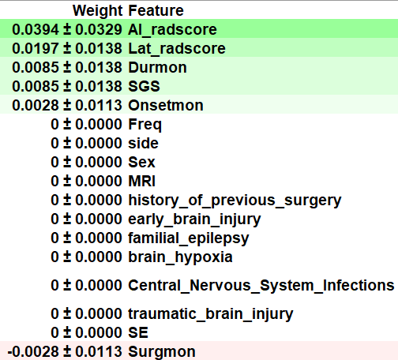

\setbeamercolor{titlelike}{bg=black,fg=white}
\newcommand\Background{%
\begin{tikzpicture}[remember picture,overlay]
\node[inner sep = 0pt, outer sep = 0pt,opacity=0.65]
  at (current page.center)
  {\includegraphics[width=\paperwidth,height=\paperheight]{images/AI.jpg}};
\end{tikzpicture}%
}
\def\begincols{\begin{columns}}
\def\begincol{\begin{column}}
\def\endcol{\end{column}}
\def\endcols{\end{columns}}
```{r setup, include=FALSE}
options(digits = 3)
knitr::opts_chunk$set(
  comment = "#>",
  echo = TRUE,
  message = FALSE,
  warning = FALSE,
  collapse = TRUE,
  out.width = "78%",
  fig.align = "center",
  fig.asp = 0.618, # 1 / phi
  fig.show = "hold"
)
```

```{r include=FALSE}
options(tibble.print_max = 5, tibble.print_min = 5)
library(showtext)
showtext_auto()
lgr::get_logger("mlr3")$set_threshold("warn")
lgr::get_logger("bbotk")$set_threshold("warn")
```

# 第一部分&emsp;绪论 

## 癫痫相关知识介绍

```{r echo=FALSE, out.width=c("100%"), fig.cap="Epilepsy Epidemiology"}
knitr::include_graphics(c("images/global_epi.png"))
```

## 研究背景及意义

\begin{columns}
\column{.45\textwidth}
\begin{figure}
\centering
% Requires \usepackage{graphicx}
\includegraphics[width=5.5cm]{images/Black-box.png}
\caption{Black-box of AI}
\end{figure}
\column{.65\textwidth}
\begin{figure}
\centering
% Requires \usepackage{graphicx}
\includegraphics[width=6.3cm]{images/xai.png}
\caption{Learning Performance Versus Explainability Trade-Off of AI}
\end{figure}
\end{columns}

<!-- ## -->

<!-- ```{r echo=FALSE, out.width=c("70%", "80%"),fig.cap="Focus on Interpretability of ML"} -->
<!-- knitr::include_graphics(c("images/Black-box.png", "images/xai.png")) -->
<!-- ``` -->
## 癫痫影像学国内外文献计量学分析

```{r echo=FALSE, out.width=c("85%"),fig.align="center", fig.cap="Flowchart of TLE Postsurgical IML"}
knitr::include_graphics(c("images/TLE_EML_Flow.png"))
```

## 研究内容及目标

研究内容及目标


## 论文的组织结构


论文的组织结构


# 第二部分&emsp;颞叶癫痫患者术前定位研究

## 引言

```{r echo=FALSE, out.width=c("110%"),fig.align="center", fig.cap="PET Radiomics  Score and Clinical-PET Features"}
knitr::include_graphics(c("images/PET_radiomics.png"))
```

## 材料与方法

```{r echo=FALSE, out.width=c("60%"),fig.align="center", fig.cap="Heatmap of Clinical-PET Features"}
knitr::include_graphics(c("images/heatplot.png"))
```

## 实验结果

**Table 1:** Performance Comparison Eleven ML Algorithms
\centering
\tiny
\begin{table}[]
\begin{tabular}{lllllllll} \hline
Model                           & Accuracy & AUC   & Recall & Prec. & F1    & Kappa & MCC   & APC   \\ \hline
Ada Boost Classifier            & 0.883    & 0.789 & 0.4    & 0.433 & 0.393 & 0.345 & 0.357 & 0.59  \\ 
Extreme Gradient Boosting       & 0.884    & 0.777 & 0.3    & 0.4   & 0.333 & 0.287 & 0.295 & 0.607 \\
Random Forest Classifier        & 0.884    & 0.763 & 0.2    & 0.35  & 0.25  & 0.217 & 0.23  & 0.612 \\
Gradient Boosting Classifier    & 0.89     & 0.762 & 0.35   & 0.483 & 0.39  & 0.346 & 0.36  & 0.591 \\
Light Gradient Boosting Machine & 0.859    & 0.749 & 0.25   & 0.325 & 0.267 & 0.211 & 0.221 & 0.512 \\
Logistic Regression             & 0.878    & 0.669 & 0.05   & 0.1   & 0.067 & 0.055 & 0.059 & 0.448 \\
Extra Trees Classifier          & 0.884    & 0.662 & 0.1    & 0.2   & 0.133 & 0.118 & 0.127 & 0.443 \\
K Neighbors Classifier          & 0.865    & 0.646 & 0.2    & 0.2   & 0.183 & 0.14  & 0.149 & 0.283 \\
Linear Discriminant Analysis    & 0.884    & 0.642 & 0.1    & 0.2   & 0.133 & 0.119 & 0.128 & 0.418 \\
Naive Bayes                     & 0.251    & 0.586 & 0.9    & 0.129 & 0.226 & 0.014 & 0.072 & 0.332 \\
Decision Tree Classifier        & 0.798    & 0.584 & 0.3    & 0.264 & 0.259 & 0.158 & 0.167 & 0.218 \\
Std                             & 0.047    & 0.172 & 0.320  & 0.490 & 0.367 & 0.368 & 0.384 & 0.200 \\ \hline
\end{tabular}
\end{table}

## 讨论

```{r echo=FALSE, out.width=c("80%"),fig.align="center", fig.cap="Illustration of AdaBoost Algorithm"}
knitr::include_graphics(c("images/AdaBoost.png"))
```
- `AdaBoostClassifier(algorithm='SAMME', base_estimator=None, learning_rate=0.2,
                   n_estimators=230, random_state=123)` 

## 小结

**Table 2:** K-folds Cross-validation of the Selected AdaBoost
\centering
\tiny
\begin{table}[]
\begin{tabular}{lllllllll}
\hline
\multicolumn{1}{c}{Tuned\_Ada} & \multicolumn{1}{c}{Accuracy} & \multicolumn{1}{c}{AUC} & \multicolumn{1}{c}{Recall} & \multicolumn{1}{c}{Prec.} & \multicolumn{1}{c}{F1} & \multicolumn{1}{c}{Kappa} & \multicolumn{1}{c}{MCC} & \multicolumn{1}{c}{APC} \\ \hline
1                              & 0.882                        & 0.733                   & 0.000                      & 0.000                     & 0.000                  & 0.000                     & 0.000                   & 0.361                   \\ 
2                              & 1.000                        & 1.000                   & 1.000                      & 1.000                     & 1.000                  & 1.000                     & 1.000                   & 1.000                   \\
3                              & 0.824                        & 0.550                   & 0.000                      & 0.000                     & 0.000                  & -0.085                    & -0.091                  & 0.183                   \\
4                              & 0.875                        & 0.893                   & 0.000                      & 0.000                     & 0.000                  & 0.000                     & 0.000                   & 0.500                   \\
5                              & 0.938                        & 0.929                   & 0.500                      & 1.000                     & 0.667                  & 0.636                     & 0.683                   & 0.750                   \\
6                              & 0.938                        & 0.964                   & 0.500                      & 1.000                     & 0.667                  & 0.636                     & 0.683                   & 0.833                   \\
7                              & 0.875                        & 0.554                   & 0.000                      & 0.000                     & 0.000                  & 0.000                     & 0.000                   & 0.321                   \\
8                              & 0.938                        & 0.964                   & 0.500                      & 1.000                     & 0.667                  & 0.636                     & 0.683                   & 0.833                   \\
9                              & 0.938                        & 1.000                   & 0.500                      & 1.000                     & 0.667                  & 0.636                     & 0.683                   & 1.000                   \\
10                             & 0.938                        & 0.679                   & 0.500                      & 1.000                     & 0.667                  & 0.636                     & 0.683                   & 0.591                   \\
Mean                           & 0.914                        & 0.827                   & 0.350                      & 0.600                     & 0.433                  & 0.410                     & 0.432                   & 0.637                   \\
Std                            & 0.047                        & 0.172                   & 0.320                      & 0.490                     & 0.367                  & 0.368                     & 0.384                   & 0.200       \\ \hline           
\end{tabular}
\end{table}


# 第三部分&emsp;颞叶癫痫患者术后复发预测研究

## 引言

```{r echo=FALSE, out.width="60%", fig.align="center", fig.cap="Permutation Importance of AdaBoost"}

``` 

## 材料与方法
PDP plots:
\begin{itemize}[<+->]
\item \begin{columns}
\column{.4\textwidth}
\begin{figure}
\centering
% Requires \usepackage{graphicx}
\includegraphics[width=6cm]{images/pdp_1.png}
\end{figure}
\column{.5\textwidth}
\begin{figure}
\centering
% Requires \usepackage{graphicx}
\includegraphics[width=6cm]{images/pdp_2.png}
\end{figure}
\end{columns}
\end{itemize}


## 实验结果


实验结果

## 讨论


讨论


## 小结


小结


# 第四部分&emsp;总结与展望

## 结论


\begin{itemize}[<+->]
\item Metabolic radiomics are helpful to predict the postsurgical seizure outcomes;
\bigskip
\item Combination of PET Radiomics and Clinical Features are more robust;
\bigskip
\item IML technique can further deepen the understanding of the principle of ML models and the decision-making process for professional and intuitive interpretation
\end{itemize}

## 研究领域展望

\begin{itemize}[<+->]
\item More data, especially external validation cohort;
\bigskip
\item Fusion of PET/MRI multimodal imaging;
\bigskip
\item Other subtypes of drug-resistant epilepsy
\end{itemize}

## 

For more theoretical approaches to machine learning model explanation, see [Interpretable Machine Learning: A Guide for Making Black Box Models Explainable](https://christophm.github.io/interpretable-ml-book/),refer to[@beghi2019global],[@rajpurkar2021deep],[@mlr3book],[@molnar2022].

\bigskip

**Email:** wane199@outlook.com

## 

\begin{center}
  \emph{\textbf{\Huge{{THANKS !}}}}
\end{center}
\Background

